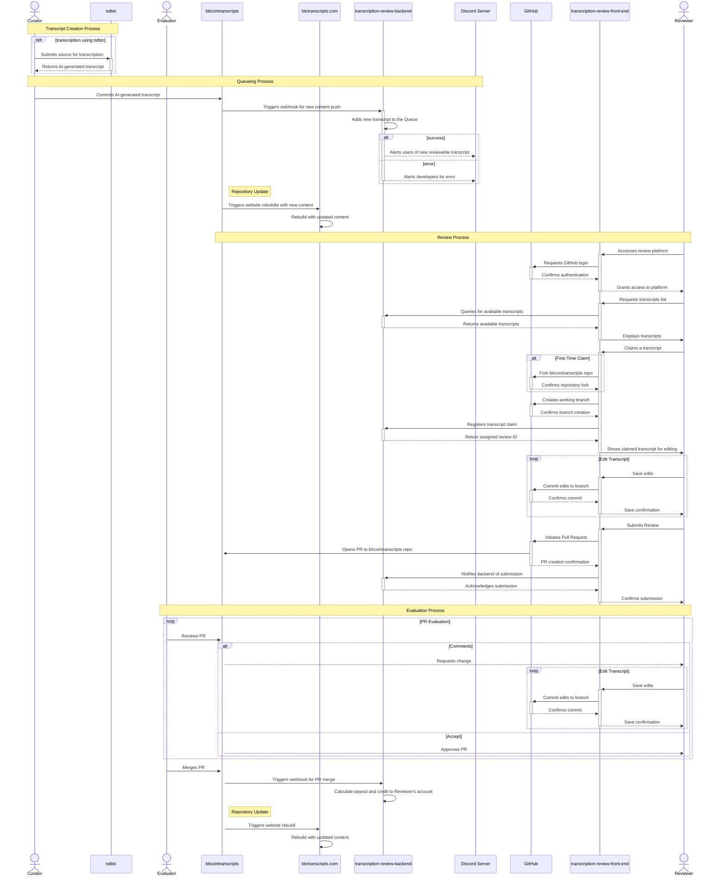

## Bitcoin Transcripts

At Bitcoin Transcripts we are building a largely autonomous transcription workflow that streamlines the AI-generation, review by humans, and publication of bitcoin tech transcripts.

### Transcription Workflow

1. **Curation**: Curators propose new content directly in the _bitcointranscripts_ repository. They submit PRs to add files representing individual items or sources for transcription, forming the Transcription Backlog.
2. **Generation & Queueing**: The _tstbtc_ transcription server processes sources from the Transcription Backlog and submits the AI-generated output back to the _bitcointranscripts_ repository. This triggers a webhook in the _transcription-review-backend_, queuing the transcript for review and notifying via the Discord Server for its availability. Concurrently, transcription metadata are archived in the _bitcointranscripts-metadata_ repository.
3. **Review**: Reviewers use the _transcription-review-front-end_ as an enhanced interface to access and edit transcripts. This front-end is linked to GitHub, where each edit is reflected as changes in a unique branch in the reviewer's fork of the repository. The platform facilitates easy viewing, claiming, and modification of transcripts, with the backend coordinating the review workflow.
4. **Evaluation**: After editing, reviewers submit their work, creating pull requests to the _bitcointranscripts_ repository. These PRs are then evaluated by an _Evaluator_ who can request further changes or approve and merge the submissions into the main repository.
5. **Payout**: Following the approval, the _transcription-review-backend_ processes the payouts for reviewers.
6. **Publication**: Approved transcripts are merged into the main _bitcointranscripts_ repository, automatically updating _btctranscripts.com_.

### Components

- **Curator**: Suggests source material for transcription.
- **[bitcointranscripts](https://github.com/bitcointranscripts/bitcointranscripts)**: The central repository storing all transcripts and serving as the source of truth for the Transcription Backlog.
- **[tstbtc](https://github.com/bitcointranscripts/tstbtc)**: A transcription server that processes source material from the Transcription Backlog to produce AI-generated transcripts.
- **[bitcointranscripts-metadata](https://github.com/bitcointranscripts/bitcointranscripts-metadata)**: An archive repository for raw model outputs and basic metadata generated by tstbtc.
- **[transcription-review-backend](https://github.com/bitcointranscripts/transcription-review-backend)**: Coordinates the review workflow, managing transcript queues, notifications, and reviewer payouts.
- **[transcription-review-front-end](https://github.com/bitcointranscripts/transcription-review-front-end)**: A user interface for reviewers to manage their review tasks, including transcript editing and submission.
- **[Discord Server](https://discord.gg/kaSKyYhmjH)**: Community engagement including alerts for users about new transcripts available for review.
- **GitHub**: Central platform for authentication, storage, and tracking submissions as part of the review and evaluation workflow.
- **Reviewer**: Community contributors who refine the AI-generated transcripts, ensuring their quality and accuracy.
- **Evaluator**: Responsible for the final review stage, assessing and approving submissions for merging.
- **[btctranscripts.com](https://github.com/bitcointranscripts/bitcointranscripts.github.io)**: The public-facing website for Bitcoin Transcripts, updated automatically with newly merged content.

 

CLICK for <b>Sequence Diagram of the Transcription Pipeline</b>

 

<!--

**Here are some ideas to get you started:**

🙋‍♀️ A short introduction - what is your organization all about?
🌈 Contribution guidelines - how can the community get involved?
👩‍💻 Useful resources - where can the community find your docs? Is there anything else the community should know?
🍿 Fun facts - what does your team eat for breakfast?
🧙 Remember, you can do mighty things with the power of [Markdown](https://docs.github.com/github/writing-on-github/getting-started-with-writing-and-formatting-on-github/basic-writing-and-formatting-syntax)
-->
